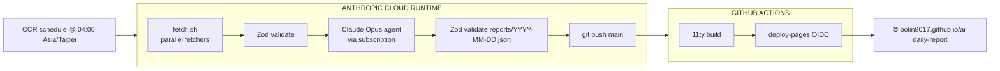

# AI Daily Report

[](https://bolin8017.github.io/ai-daily-report/)
[](https://github.com/bolin8017/ai-daily-report/actions/workflows/deploy.yml)

AI-powered daily creative tech brief for AI engineers who build. A Claude Code agent collects signals from GitHub Trending, GitHub topic search (freshness-first, ≤30-day-old repos), Hacker News, Lobsters, Dev.to, Anthropic News, HuggingFace Daily Papers, and ~15 RSS sources; synthesizes them into a senior-analyst daily brief with concrete side-project ideas and binary-falsifiable predictions; and publishes to GitHub Pages.

**Core value:** not "what's trending" but **"what should an AI engineer who builds (RAG, VLM, fine-tuning, agents, MCP) change in their stack or weekend plans today"**. The brief is deliberately builder-focused — no vendor-strategy punditry, no business-model talk, no decision-maker framing. If you're looking for "should my company buy Claude or GPT", this isn't it. If you're looking for "today's discovery picks I should clone" and "this week's idea I should actually try", it is.

> **Live:** https://bolin8017.github.io/ai-daily-report/

## How it works



**Why this architecture?** The daily pipeline runs on Anthropic Cloud Runtime (CCR) — a scheduled Claude Code session on Anthropic's cloud — so there's zero local machine dependency. CCR sessions count against the Claude Code Max subscription (not API billing), preserving the Opus-quality / no-daily-quota advantage. Build and deploy stay in GitHub Actions because they're deterministic, free, and keep the deploy path push-driven. See [ARCHITECTURE.md](./ARCHITECTURE.md) for the full design rationale.

## Report sections

| Tab | Content |
|---|---|
| **動手做 — 混搭靈感** | 3 concrete side-project ideas, each with a role-anchored use case, tech stack, hardware needs, honest difficulty + dev-time grading, and a first-step command. At least one idea is non-AI/dev-tooling (hardware, civic tech, science) |
| **今日上線** | 12–20 curated items mixing HN / Lobsters / AI lab RSS / **discovery picks from GitHub topic search** (freshly-created ≥100★ repos surfaced before they hit trending) + developer watch (high-follower devs' new repos from last 72h) |
| **社群脈動** | Agent-curated "if you only read 5 things" list + raw HN / Lobsters / community feeds for drill-down |
| **趨勢訊號** | Lead story (senior-analyst briefing: 發生了什麼 → 為什麼重要 → 社群怎麼看 → 行動建議) + 3–4 trend signals with cross-source evidence + sleeper pick with commercial path + contrarian take with binary falsifiable prediction + 5–7 dated binary predictions |

## Scheduled deployment

The pipeline runs as a single Node process (`src/pipeline.js`) inside a Docker container, scheduled by cron on a Google Cloud e2-micro VM (always-free tier). Every day at 04:00 Asia/Taipei:

1. Host cron fires `scripts/cron-run.sh`, which `docker run`s `ai-daily-report:latest` with `--memory=600m` and the host's `~/.claude` + `GITHUB_TOKEN` bind-mounted in
2. Container entrypoint `git pull`s the latest `main` into a persistent workspace volume and runs `node src/pipeline.js`
3. The pipeline fetches 4 sources in parallel, calls `claude -p` twice (report, then memory update), validates against Zod schemas, and `git push`es
4. GitHub Actions picks up the push and deploys to Pages

**Why VM + cron instead of Anthropic Cloud Runtime**: an earlier iteration tried to run the agent inside CCR but hit two dead ends — nested `claude -p` subprocesses deadlocked on SSE keepalive, and the 10K-token Read-tool limit made a merged digest file unusable. A bare VM has neither constraint. See [ARCHITECTURE.md](./ARCHITECTURE.md) for the full rationale.

**External dependency:** RSSHub instance at `https://rsshub.pseudoyu.com` (public, community-maintained by [@pseudoyu](https://github.com/pseudoyu)). Fallback: `https://rsshub.rssforever.com`.

## Quick start (local dev)

Use this only if you're iterating on code, prompts, or templates. Scheduled production runs don't need any of this.

### Prerequisites

- **Node.js 22+**
- **Claude Code subscription** (Max plan recommended for Opus access)
- **GitHub token** with `Contents: read/write` scope (for the fetchers' Octokit calls)

### Setup

```bash
git clone https://github.com/bolin8017/ai-daily-report.git
cd ai-daily-report
npm ci

# Set up env
cp .env.example .env
# Edit .env: GITHUB_TOKEN=ghp_...

# One-time Claude Code login (only needed for --full runs)
claude    # then /login in the REPL

# Fetch + snapshot + condense only (no LLM call, no commit)
npm start

# Full pipeline including claude -p (requires Claude login, uses Max quota)
bash scripts/run.sh --full

# Full pipeline but skip git push — useful for prompt iteration
bash scripts/run.sh --skip-push
```

`--full` runs both `claude -p` calls and git-pushes at the end; `--skip-push` does the LLM calls but leaves the result uncommitted. Default `npm start` is the dry run (no LLM, no push) — use this while iterating on fetchers or templates.

## Project structure

See [CLAUDE.md](./CLAUDE.md) for the full file-by-file guide.

```
src/
  pipeline.js       # Main entry — fetch → condense → synthesize → validate → commit
  fetchers/         # Dual-mode JS fetchers (feeds, trending, search, developers)
  schemas/          # Zod schemas — single source of truth
  lib/              # condense, snapshot, synthesize (claude -p wrapper), commit
scripts/
  run.sh            # Local dev wrapper
  cron-run.sh       # Host cron entry (VM)
  docker-entrypoint.sh  # Inside-container entry
  setup-vm.sh       # One-time VM install
Dockerfile          # node:22-slim + git + claude CLI
site/               # 11ty templates (Nunjucks)
data/               # Committed state (reports/, memory.json, feeds-snapshot.json)
tests/              # Vitest unit tests
```

## Development

```bash
npm test                 # Vitest schema tests
npm run lint             # Biome check
npm run format           # Biome format --write
npm run validate:report  # Validate latest data/reports/YYYY-MM-DD.json against ReportSchema
npm run serve            # 11ty dev server with live reload
```

## What's externally maintained vs self-maintained

| Concern | Tool | Why |
|---|---|---|
| **Scheduling runtime** | Google Cloud e2-micro VM (always-free) + cron + Docker | Zero monthly cost, full control, no nested-claude problem |
| **LLM call** | `claude -p` against the Max subscription | No API billing; Claude Code CLI ships a headless print mode that fits nicely inside a container entry script |
| **Data aggregation (HN, Dev.to)** | Public [RSSHub](https://github.com/DIYgod/RSSHub) instance at `rsshub.pseudoyu.com` | Community-maintained, covers hundreds of sources, no self-hosting |
| **AI analysis** | Claude Sonnet 4.6 via `claude -p` | Best price/performance for the report workload; Max subscription covers usage |
| **Static site build** | [11ty](https://github.com/11ty/eleventy) | Mature, fast, JS-native, perfect for daily content |
| **Schema validation** | [Zod](https://github.com/colinhacks/zod) | TypeScript-first, the standard |
| **Linting + formatting** | [Biome](https://github.com/biomejs/biome) | Replaces ESLint+Prettier with one fast tool |
| **Testing** | [Vitest](https://github.com/vitest-dev/vitest) | Modern, fast, ESM-native |
| **Deploy** | [actions/deploy-pages](https://github.com/actions/deploy-pages) | Official GitHub Pages OIDC deploy |
| **HTML scraping** | [cheerio](https://github.com/cheeriojs/cheerio) | Used in `github-trending.js` instead of regex |
| **GitHub API** | [Octokit](https://github.com/octokit/octokit.js) | Bundles retry + throttling plugins by default |
| **Self-maintained** | Agent prompt · 11ty templates · CSS theme · Zod schemas · `src/pipeline.js` orchestration | The IP that makes this differentiated |

## License

MIT — see [LICENSE](./LICENSE).
